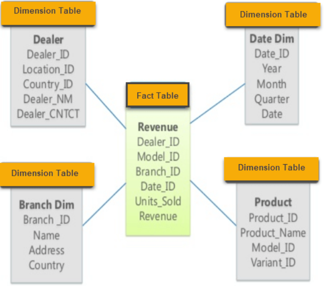
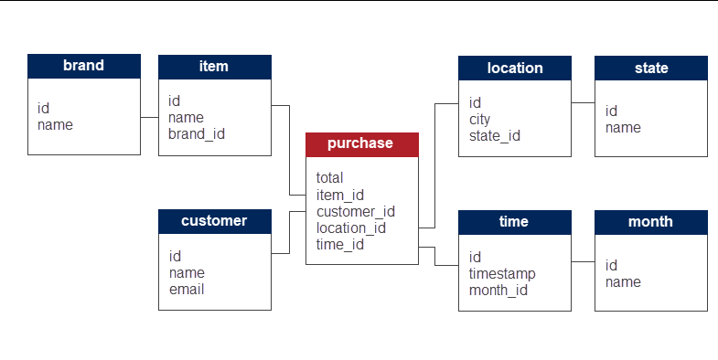

# DB in Cloud - Courses
## Course1 30.09.2025
Final grade:    
|   
|->30% written exam durring session     
|->25% MS teams homeworks + AWS acad    
|->25% project  
|->20% ...we'll think about it...   
### ATTENDANCES TO SEMINARS AND COURSES ARE NOT MANDATORY
AT LEAST 7 ATTENDANCES => 1p bonus at the exam  
### MySQL => we have to use triggers for maximum grade (final doc seminar 1)
. -> for 8->9   
. -> for 9->10  (the interrogation with AS FOR or PERIOD FOR)  

instanturi = instanta de timp   
    
DDL -> the STRUCTURE    
DML -> the OPERATIONS   
    
Data warehousing:   
-OLTP Online Transaction Process: DB in at least 3NF (removes all the operations that could appear at delete/insert)    
-OLAP Online Application Processing: star schema or snowflake schema    
   
OLAP star schema:   
  
    
OLAP scnowflake schema:     

    
Take from OLTP -> modify so we are able to store on OLAP -> OLAP    
    
CDC (Change Data Capture) = tracks and records data modifications (inserts, updates, and deletes) from a source system => enables REAL-TIME analytics     
    
!!!!Smth. NULL can be compared only with IS NULL/IS NOT NULL    
Transaction time or System time     
    
Candidate key -> attributes that identifies the record uniquely     
Surogate key -> usually used as a primary key   
!!!! For the same PK we can have different time periods => add time to PK   
    
SCN (System Change No)  
    
Even if the data is deleted => they are still in the hystory (at valid time, the history is not kept)  
    
## Course2 7.10.2025

Transaction time:  
INTRETINUT DE SISTEM  
-functionalitati de rollback  
  
Oracle cel mai avansat dpdv al persp. temporale:  
oracle sql server, postgres(cu ajut extensiilor are suport temporal)  
  
  
Valid time:  
data correction (putem si noi sa il schimbam)  
  
pentru perioadele de validitate se ataseaza metadate (backwards compatibility) e.g. PERIOD FOR  
  
Oracle - valid time de la versiunea 12c  
  
### ------------------Cloud DB------------------  
  
Traditional Approach:  
The client purchases a server  
Clientul are nevoie de un DNS pentru ca noi sa ii putem furniza app  
  
DNS Domain Name Server, mappin the ip to a name  
Web server ajung req care sunt trimise la app server  
App server preg. response-uri si le trimite la web server  
    
## Course3 14.10.2025
Cloud DB    
IaaS nu trebuie sa stim de sistemul de operare decat ca il avem si de acolo putem sa dezvooltam     
Scalare: adaugare/scoatere resurse   
    
Versiune Alpha, stare incipienta poate avea si buguri   
Versiunea Betha e dat unui utilizator care a testat functionalitatile si buguri rezolvate   

Vertical scaling - app on premises, nedistribuita, daca avem trafic mare, trebuie sa oprim pc-ul si sa adaugam hardware mai mult (scalare in sus) daca scade traaficul atunci ajungem inapoi la pc-ul vechi: calculele le facem pe o masina mai mica sau mai mare        
RDBMS - nu poate fi Stateless -> mai greu de scalat orizontal   
Utilizator simte downtime-ul cand schimbam hardware
    
Horizontal scaling - fie adaugam fie scoatem resurse similare (e.g. creste load-ul mai adaugam o masina): calculele le facem pe mai multe masini, tot adaugam masini => nevoie de Stateless (req. consecutive pot ajunge pe masini diff)    
    
Uneori in loc de loadBAlancer putem avea conectionPool (ai un nr limitat de conexiuni si mai multe cereri)  
Utilizatorul nu simte downtime la adaugare resurse      
    
Auto scaling (scaling up/in e mai usor la horizontal scaling decat la vertical)     
    
## Scaling strategies: 
### Dynamic
Daca e intre anumite valori e ok, daca e peste atunci asteptam un interval de timp (treshold) si daca trece timpul abia atunci actionam (pt ca putem avea fluctuatii scurte si nu ne ajuta sa actionam imediat)   
### Scheduled
Use the scheduler to prepare the resources before the demand will happen    

## Traffic routing - esp horizontal scaling
-connection pools   
-load balancers     
-DNS load balancer - daca mai multa lume face req la acelasi nume => va trimite ip-uri diferite la unele persoane   
-app aware of scaling -> avem o conexiune deschisa pt write si una pt read, pt ca la read vrem sa avem mai multe noduri de read, avem un load balancer pt read care distribuie la nodurile de read. NOdul de writer va pune intr-un fisier transaciton\_logs de ne reader-ii o sa isi pastreze actualizate datele.  

## SSL - Secure Socket Layer
## SSL offloading - for load balancer
The load balancer encrypts and decrypts data

## ACID se foloseste la cele care au C si BASE la cel de al treilea care nu are Consistency
## BASE Basically Available, Soft state, Eventually consistent
    
Write ahead log - inainte de a salva se pune in write-ahead-log
    
##  Partitioning
One big table partition into more tables, se cauta cheia care filtreaza cel mia bine randurile in functie de modul de acces la date (pt eficientizare join-uri) - unele baze de date permit, mai multe tabele fizica sunt inglobate intr-o tabela mare logica si noi vedem doar tabela logica       
    
## Sharding
SImilar to partitioning but the data is distributed across multiple nodes (Tabela o vedem una dar datele din ea sunt imprastiate pe noduri)     
Pentru RDB nu prea functioneaza dar MySQL are un tool ce permite si PostgreSQL a preluat ideea.     
Pe AWS avem DSQL (Distributed SQL)     
## Course4 21.10.2025
Question - for seminar1 homework, one table with both realtime rows and history rows or we need to have separate tables for realworld and history rows? If yes, how do we know when to move a row from realworld to history (based on transaction\_time or on valid\_time?) ?   
 
