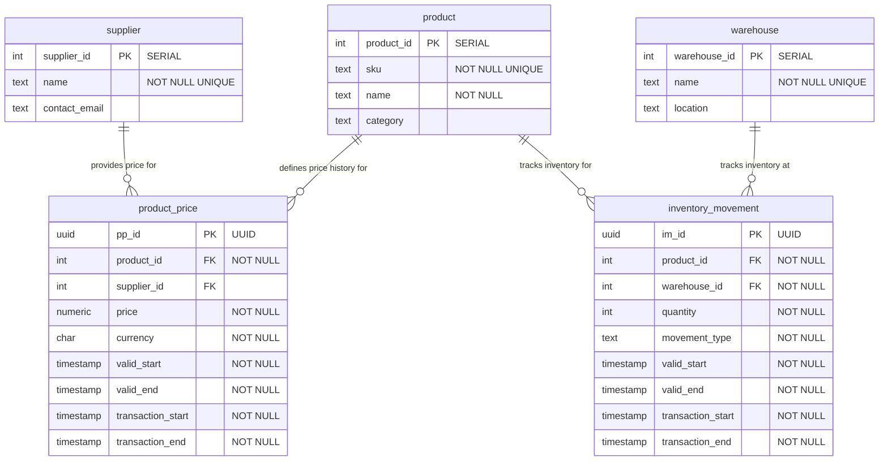

```mermaid
erDiagram
    supplier {
        int supplier_id PK "SERIAL"
        text name "NOT NULL UNIQUE"
        text contact_email
    }

    warehouse {
        int warehouse_id PK "SERIAL"
        text name "NOT NULL UNIQUE"
        text location
    }

    product {
        int product_id PK "SERIAL"
        text sku "NOT NULL UNIQUE"
        text name "NOT NULL"
        text category
    }

    product_price {
        uuid pp_id PK "UUID"
        int product_id FK "NOT NULL"
        int supplier_id FK
        numeric price "NOT NULL"
        char currency "NOT NULL"
        timestamp valid_start "NOT NULL"
        timestamp valid_end "NOT NULL"
        timestamp transaction_start "NOT NULL"
        timestamp transaction_end "NOT NULL"
    }

    inventory_movement {
        uuid im_id PK "UUID"
        int product_id FK "NOT NULL"
        int warehouse_id FK "NOT NULL"
        int quantity "NOT NULL"
        text movement_type "NOT NULL"
        timestamp valid_start "NOT NULL"
        timestamp valid_end "NOT NULL"
        timestamp transaction_start "NOT NULL"
        timestamp transaction_end "NOT NULL"
    }

    product ||--o{ product_price : "defines price history for"
    supplier ||--o{ product_price : "provides price for"
    product ||--o{ inventory_movement : "tracks inventory for"
    warehouse ||--o{ inventory_movement : "tracks inventory at"
```