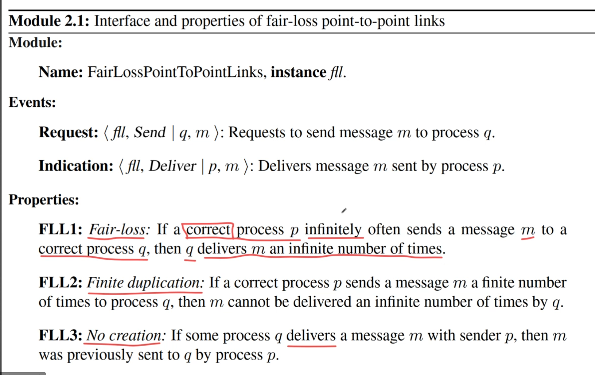
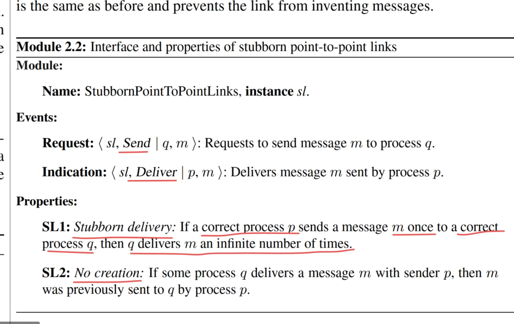
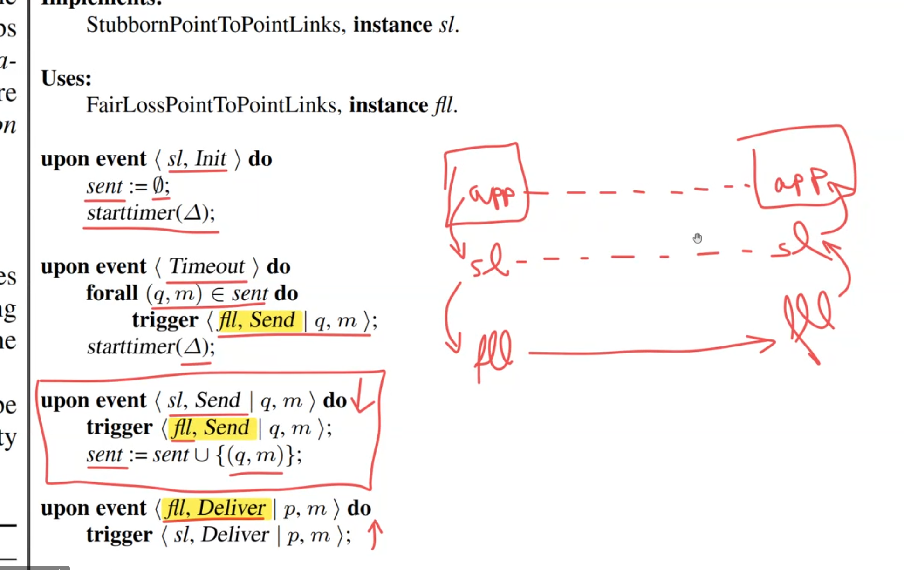
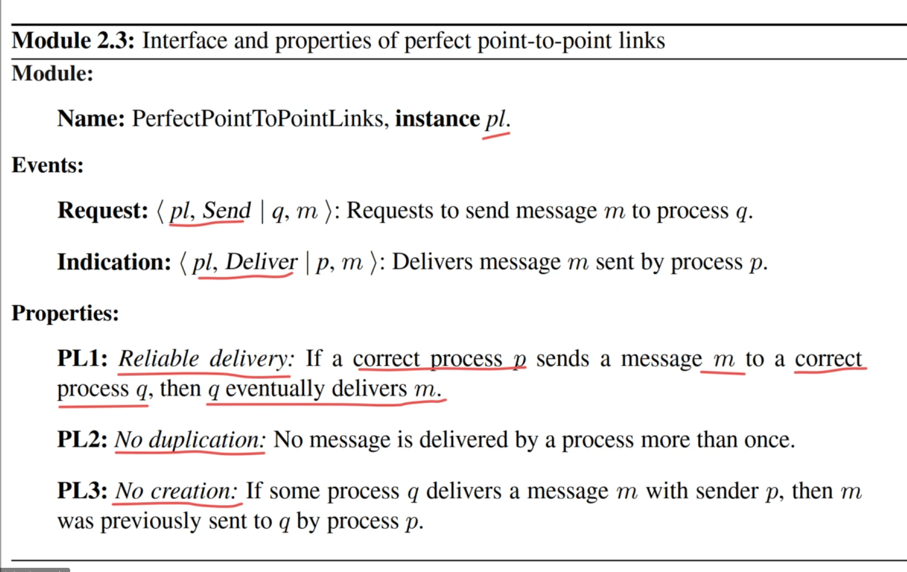
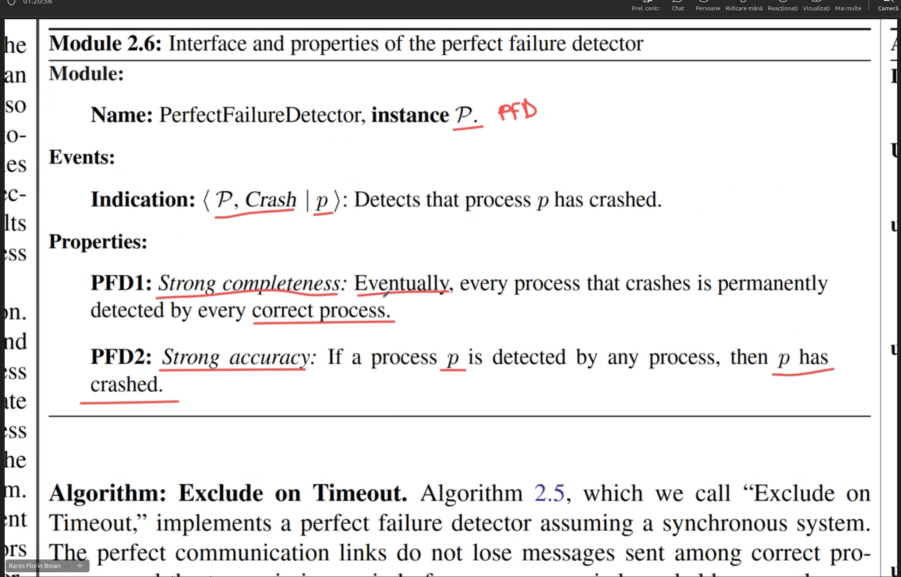
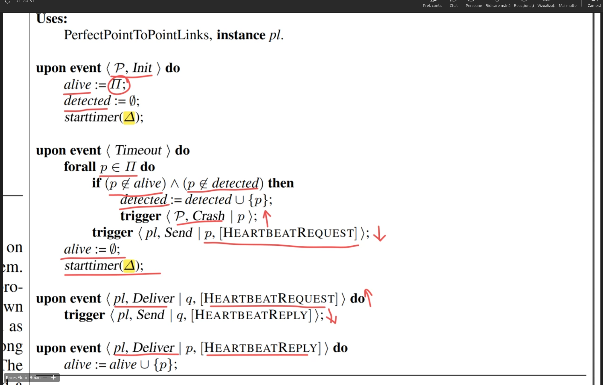

# ------------------Seminar1----------------26.02.2026  
HOMEWORK TO DO: THE REQUIREMENTS PROBLEM    
DEADLINE- week 3/4

the problem will be implemented by us and presented at the seminar(tested) when we'll meet physically (seminar2/3)

No mandatory presence for seminars/courses  

   

# ------------------Course1----------------26.02.2026  
Ex Examination period   
Rx REexamination    
    
For projects we'll have assignments on teams    
    
We'll work from the book link on the courses site   
[https://www.cs.ubbcluj.ro/~rares/course/amcds/](https://www.cs.ubbcluj.ro/~rares/course/amcds/)    

4 big classes algorithms we are looking for:    
* basic algorithms
* broadcast
* shared memory
* consensus algorithms
    
Any distributed system will have to run on a network => needs cables    
Wires = fair loss link (the inf can be lost - e.g sb cuts the cable)    
    
Types of algorithms:    
* fail-stop - work with processes that can only fail when crashing  either works perfectly or is dead (the other nodes can detect that reliably)    
* fail silent - you can't figure out when are crashed
* fail noisy - similar to fail-stop you can detect...but it's not reliable
* fail recovery node - nodes that crash and recover 
* fail arbitrary - e.g in any airplane you have 4 of each sensor (4 of altitude snesors 4 of ... sensors) why 4? because if it fails, that sensor won;t shut up, will give wrong values => you need extra sensors to figure out which snesor is out of order
* randomized - do not try to solve the roblem perfectly, i tries to solve it with a probability margin
    
Type of algorithms base on what type of: type of Nodes, type links, what about the other nodes we can know      
        
EVENTS = INTERFACE (LIKE IN CLASSES)    
PROPERTIES = CONTRACT (LIKE IN CLASSES)     
CORRECT PROCESS = the process doesnt crash, doesnt behave malliciously  
There will be no implementation for FairLossLink because is the very base level (wires)     

## FairLossLink 
   

## StubbornLinks - algorithm = retransmit forever
     
Algorithm explanation:  
We set the timer delta times, and delta times is sent the message infinetely (timeout)  
   

## Perfect Links - are supposed to be a certain TCP
It will eventually be delivered but only once
### Abstraction
   
    
### Implementation
We store it into the `deliver` set to assure we dont send it twice    
       

## Failure Detection
E.g if it doesnt answer in five second after giving it a ping .... but we are using maths now   

### Abstraction
     

### IMplementation
for every p (EVERY NODE)    
alive - a set   
deliver - a set     
    
If a node doesnt answer within delta then is dead   
Delta is like a god given constant - is math -      
       

